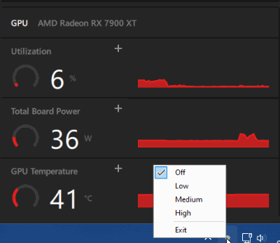

# Keep-Alive Render Loop (Beta)

Fixes AMD GPU Crashes During Low Usage
Problem: Some AMD GPUs (like the 7900XT/XTX) crash or freeze during light tasks (web browsing, idle) due to low power states.
So far I've ran the application on low and not experienced a crash even when leaving the PC idle

Solution: This app keeps your GPU slightly active by rendering a hidden black canvas, preventing crashes.

Here are some posts from the AMD forum with users experiencing thse problems. (Based on AMD forum reports)
-[https://community.amd.com/t5/pc-drivers-software/7900xt-driver-timeout-results-in-pc-freeze](https://community.amd.com/t5/pc-drivers-software/7900xt-driver-timeout-results-in-pc-freeze/m-p/712294)
- [https://community.amd.com/t5/pc-drivers-software/7900xt-driver-low-idle-voltage-may-cause-instability](https://community.amd.com/t5/pc-drivers-software/7900xt-driver-low-idle-voltage-may-cause-instability/m-p/710886#M197752)
- [https://community.amd.com/t5/pc-drivers-software/all-amd-pc-randomly-freezes-in-light-tasks-like-watching-youtube](https://community.amd.com/t5/pc-drivers-software/all-amd-pc-randomly-freezes-in-light-tasks-like-watching-youtube/m-p/589667#M170705)
- [https://community.amd.com/t5/general-discussions/pc-unresponsive-and-freezes-up-randomly](https://community.amd.com/t5/general-discussions/pc-unresponsive-and-freezes-up-randomly/m-p/640784#M43632)

## Features

- ✔ Zero UI distraction – Runs invisibly in the system tray
- 🐢 Low (120 MAX FPS): Gentle on power usage
- 🚗 Medium (1250 MAX FPS): Balanced performance
- 🚀 High (Unlimited): Maximum GPU utilization
- 👣 Micro footprint – <1% CPU usage, ~20MB RAM

## Usage

1. Run KARenderLoop.exe (no admin rights needed)
2. Check your system tray
3. Right-click the tray icon to configure

## Demo - Click Play

